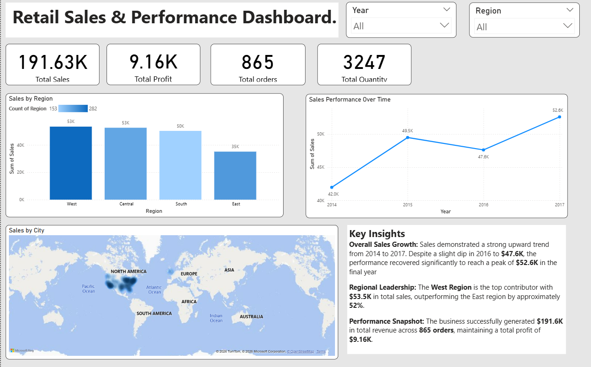
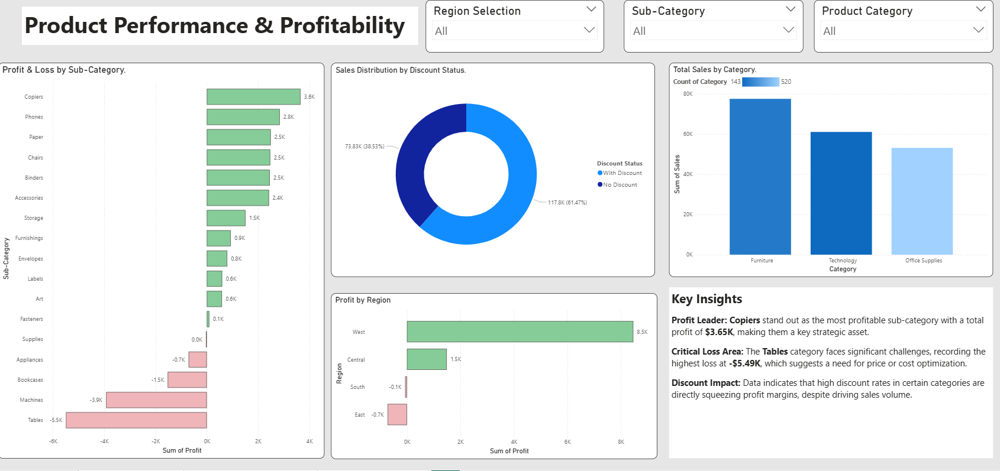
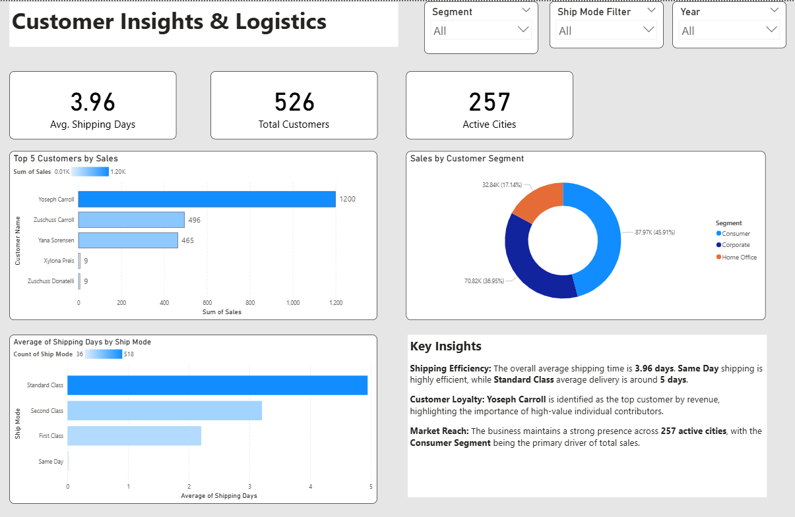

# Global Retail Sales & Logistics Dashboard

## Project Overview
[cite_start]This Power BI project provides a deep-dive analysis of a global retail dataset from 2014 to 2017[cite: 1, 56]. The goal was to transform raw sales data into actionable business insights, focusing on revenue trends, product profitability, and shipping efficiency.

## Key Insights

### 1.Retail Sales & Performance Dashboard.
* [cite_start]**Overall Sales Growth:** Sales demonstrated a strong upward trend from 2014 to 2017. Despite a slight dip in 2016 to **$47.6K**, the performance recovered significantly to reach a peak of **$52.6K** in the final year[cite: 49, 50, 56].
* [cite_start]**Regional Leadership:** The **West Region** is the top contributor with **$53.5K** in total sales, outperforming the East region by approximately 52%[cite: 30, 57].
* [cite_start]**Performance Snapshot:** The business successfully generated **$191.6K** in total revenue across **865 orders**, maintaining a total profit of **$9.16K**[cite: 2, 7, 11, 58].

### 2. Product Performance & Profitability
* [cite_start]**Profit Leader:** **Copiers** stand out as the most profitable sub-category with a total profit of **$3.65K**[cite: 62, 136].
* [cite_start]**Critical Loss Area:** The **Tables** category faces significant challenges, recording the highest loss at **-$5.49K**[cite: 82, 137].
* [cite_start]**Discount Impact:** Data indicates that high discount rates in certain categories are directly squeezing profit margins[cite: 138].

### 3. Customer Insights & Logistics
* [cite_start]**Shipping Efficiency:** The overall average shipping time is **3.96 days**[cite: 140, 193]. [cite_start]**Same Day** shipping is highly efficient, while **Standard Class** average delivery is around **5 days**[cite: 165, 168, 194].
* [cite_start]**Customer Loyalty:** **Yoseph Carroll** is identified as the top customer by revenue[cite: 144, 195].
* [cite_start]**Market Reach:** The business maintains a strong presence across **257 active cities**, with the **Consumer Segment** being the primary driver of total sales (45.91%)[cite: 182, 188, 196].

## Screenshots

## Tools Used
* **Power BI Desktop** (Data Visualization & DAX)
* **Power Query** (Data Cleaning & Transformation)
